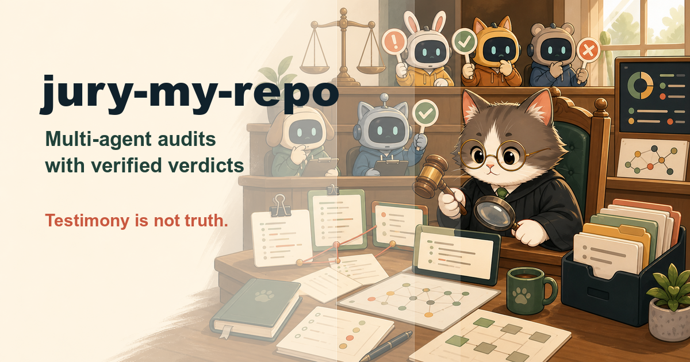

# jury-my-repo

**A jury of AI agents audits your codebase — then the claims themselves go
on trial.**

`jury-my-repo` is an [agent skill](https://vercel.com/docs/agent-resources/skills)
that drafts every AI coding agent CLI installed on your machine — Claude
Code, Codex, Gemini CLI, OpenCode, Kimi, Cursor, Qwen, Aider, Goose, Crush,
Droid, Copilot — into an audit panel. Same brief, same codebase, parallel
independent runs. Then the cross-examination: every claim from every agent
is verified against the actual code, and the final report says who was
right, who was wrong, and who hallucinated.

One auditor has blind spots; a jury has fewer — and a jury whose testimony
gets verified has almost none.

## How it works

```
/jury-my-repo . focus: security
```

1. **Detect jurors** — probes PATH for known agent CLIs, verifies each
   one's headless mode against its own `--help` (flags drift; the catalog
   is a starting point, the binary is the truth).
2. **Consent gate** ⛔ — each juror burns YOUR tokens on its own vendor
   account. The roster, cost note, and estimated wall time get explicit
   approval before anything runs. Headless/CI runs can't grant consent —
   the skill degrades to a solo audit stamped `DEGRADED` instead of
   launching anyone.
3. **One brief for all** — a standardized audit brief with numbered scope
   items (bugs / security / architecture / tests) and a pinned output
   contract: `file:line`, severity, evidence, and an explicit
   "nothing found" per scope item — silence on a scope item is a coverage
   failure, not a pass. No hints about suspected bugs — priming the jury
   contaminates the comparison.
4. **Parallel run, isolated** — every juror executes headless in its own
   disposable git worktree, timeboxed; mutations are reverted and logged.
   The orchestrating agent audits too — as juror #0, same rules, no
   special treatment.
5. **Each report preserved verbatim** — the per-agent record, then parsed
   into one findings table.
6. **Cross-examination** — dedup, then verify every unique claim against
   the code: **CONFIRMED** (evidence quoted) / **REFUTED** (with the
   evidence why — the hallucination pile) / **UNVERIFIABLE** (quarantined,
   never silently promoted). **No majority vote** — three agents repeating
   the same wrong claim is a shared hallucination, not a confirmation.
7. **Verdict** — `.jury/VERDICT.md`: the verified defect list worst-first,
   the refuted-claims section (what makes the audit trustworthy), and the
   scoreboard:

| Agent | Findings | Confirmed | Refuted | Unverifiable | Unique confirmed | Precision |
|-------|---------:|----------:|--------:|-------------:|-----------------:|----------:|

Every scoreboard cell is recomputed from the findings table (per agent,
findings = confirmed + refuted + unverifiable), and the verdict passes a
mechanical acceptance checklist — including a panel-integrity section
(who completed, who failed, and why) — before it is presented.

Rerunnable after fixes land — confirmed findings should disappear; the
`.jury/` history is the audit trail.

## Feasibility notes

- Every major agent CLI ships a headless mode (`claude -p`, `codex exec`,
  `gemini -p`, `opencode run`, `kimi --print`, `cursor-agent -p`,
  `aider --message`, `goose run`, `crush run`, `droid exec`, …) — see
  [references/agent-cli-catalog.md](references/agent-cli-catalog.md).
- **Devin** is a cloud service without a standard local CLI — optional API
  integration only.
- Worktree isolation is the universal mutation guard; per-CLI sandbox
  flags are defense-in-depth on top.

## The skill family

| Skill | Moment |
|-------|--------|
| [know-my-repo](https://github.com/silkyland/know-my-repo) | Day one: onboard onto a repo with zero knowledge |
| [deep-plan](https://github.com/silkyland/deep-plan) | Plan the next feature/refactor — evidence-gated, 7 phases |
| [deep-plan-ingest](https://github.com/silkyland/deep-plan) | Distill an accepted plan into living knowledge files |
| [clean-slate](https://github.com/silkyland/clean-slate) | Reset rotten knowledge files — backup-gated |
| [transform-my-repo](https://github.com/silkyland/transform-my-repo) | Change the architecture: migration feasibility + strategy |
| [twin-my-site](https://github.com/silkyland/twin-my-site) | Extend the web product with a native mobile twin |
| **jury-my-repo** | Multi-agent adversarial audit with a verified verdict |
| [love-me-love-my-docs](https://github.com/silkyland/love-me-love-my-docs) | A user manual that regenerates itself |
| [seed-ah](https://github.com/silkyland/seed-ah) | Fake-but-production-like demo data with a manifest |
| [create-my-team](https://github.com/silkyland/create-my-team) | Spawn and manage a subagent team for any mission |
| [reproduce-my-bug](https://github.com/silkyland/reproduce-my-bug) | Prove the bug before anyone fixes it |

Shared law: **no claim without evidence** — here applied to the AI agents
themselves: their findings are testimony, and testimony gets verified
against the code before it counts. The verdict hands off to deep-plan
(Phase 0 = confirmed security/correctness fixes).

## Install

```bash
npx skills add silkyland/jury-my-repo
```

Or copy this directory into your agent's skills folder
(e.g. `~/.claude/skills/jury-my-repo/`).

## Structure

```
jury-my-repo/
├── SKILL.md                          # 7-step workflow + hard rules (consent, isolation, no majority vote)
└── references/
    ├── agent-cli-catalog.md          # Known CLIs + headless invocations + safety notes
    ├── audit-brief.md                # The standardized brief + output contract
    └── verdict-protocol.md           # Dedup, verification, scoreboard, distillation + acceptance checklist
```

Follows the [Vercel skills](https://github.com/vercel-labs/skills) single-skill
layout and [Anthropic's skill authoring best practices](https://platform.claude.com/docs/en/agents-and-tools/agent-skills/best-practices).

## License

MIT
